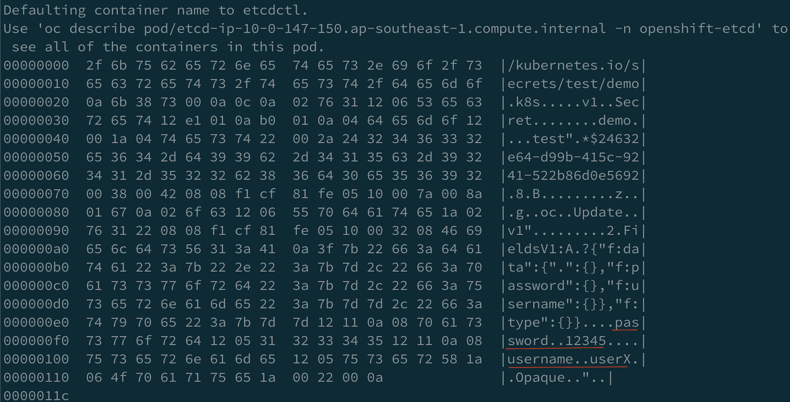
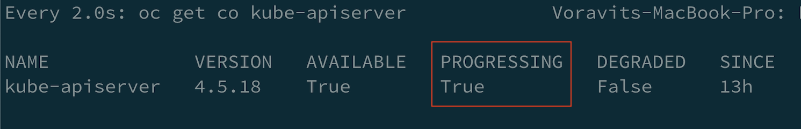
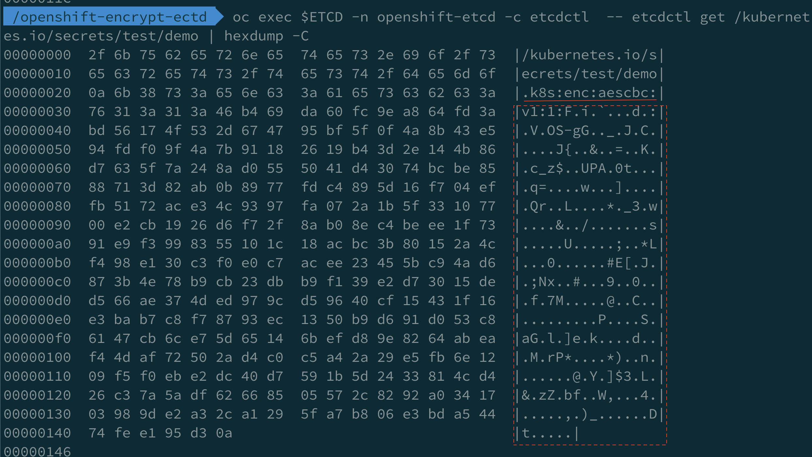

# Encryption at rest (etcd encryption)
  - create sample secret demo in namespace test
  ```bash
  oc new-project test
  oc create secret generic demo --from-literal=username=userX  \
   --from-literal=password=12345 -n test
  ```
  - Run following command to view data inside etcd for secret name **demo** in namespace **test**
    ```bash
    ETCD=$(oc get pods -n openshift-etcd --no-headers | grep etcd | head -n 1 | awk '{print $1}')
    oc exec $ETCD -n openshift-etcd  -- etcdctl get /kubernetes.io/secrets/test/demo | hexdump -C
    ```
    Sample output
    

- Encrypt etcd data including configmap, secret, route,OAuth token
  - Edit apiserver 
    ```bash
    oc edit apiserver
    ```
  - Add encryption to aescbc (default is identity)
    ```yaml
    spec:
      encryption:
        type: aescbc
    ```
- Check kube-apiserver cluster operator and wait for couple of minutes
```bash
watch oc get co kube-apiserver
```
Sample output


- Check kube-apiserver cluster operator
```bash
oc get openshiftapiserver -o yaml | rg Encrypted -B4
```
Sample output
```bash
 message: 'All resources encrypted: routes.route.openshift.io, oauthaccesstokens.oauth.openshift.io,
        oauthauthorizetokens.oauth.openshift.io'
      reason: EncryptionCompleted
      status: "True"
      type: Encrypted
```
- Verify secret again this time data is encrypted. Algorithm will show as **k8s:enc:aescbc:v1:**
```bash
oc exec $ETCD -n openshift-etcd  -- etcdctl get /kubernetes.io/secrets/test/demo | hexdump -C
```
Sample output

